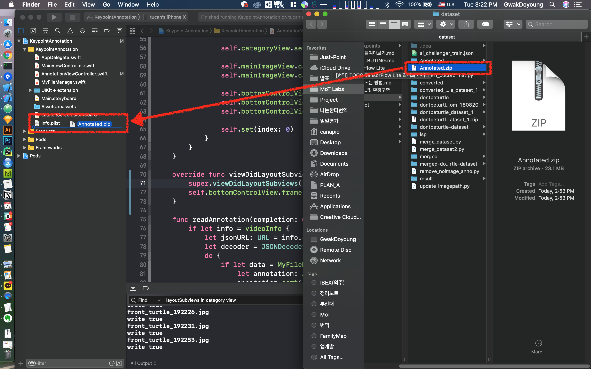

# KeypointAnnotation

This project help create (anything) estimation dataset on iOS.<br>
Once you had image set, you can annotate estimation point through touch and drag. 


And then export json as [COCO format](http://cocodataset.org/#format-data).

## Prerequirments

### Prepare Annotated.zip and then move to Xcode project

Before annotation you need to prepare `Annotated.zip` following structure. 

> *‼️`Annotated`, `annotation.json`, `images` name must not be changed‼️*

> If you have already a bunch of images, you can make annoated dataset as this format by using [dont-be-turtle-pose-annotation-tool](https://github.com/motlabs/dont-be-turtle-pose-annotation-tool).

```
Annotated
  ├ dataset001
    ├ annoation.json
    ├ images
      ├ img_0000001.jpg
      ├ img_0000002.jpg
      ├ img_0000003.jpg
      ├ ...
  ├ dataset002
    ├ annoation.json
    ├ images
      ..
```

And import **the zip file** to this project.



And then run the project.